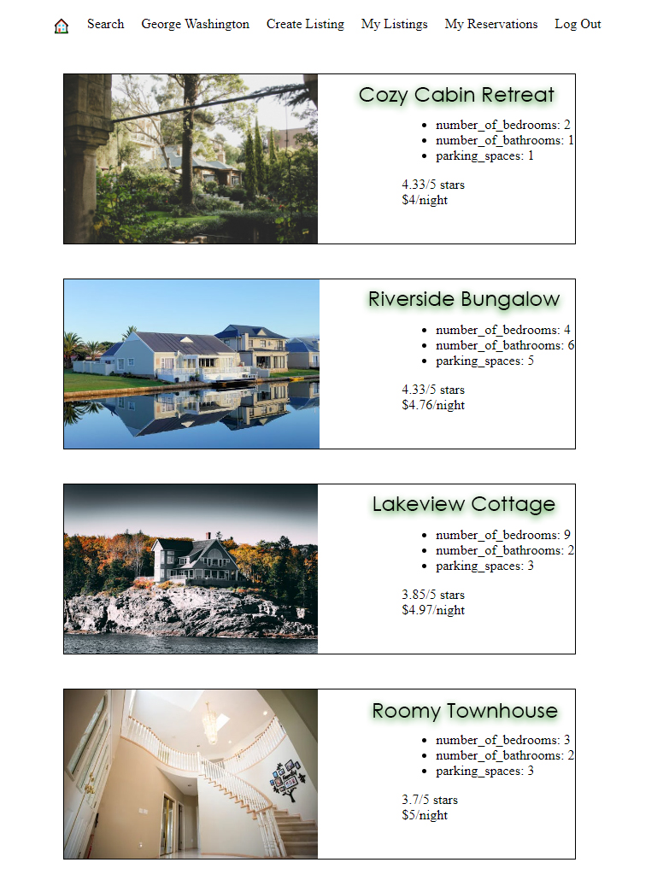
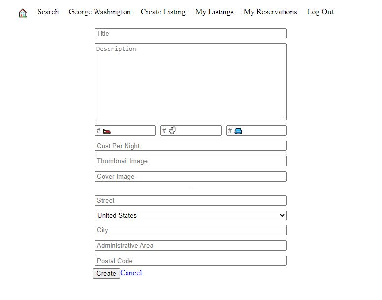
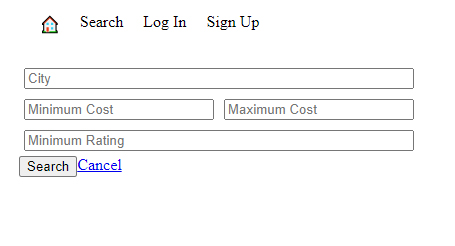
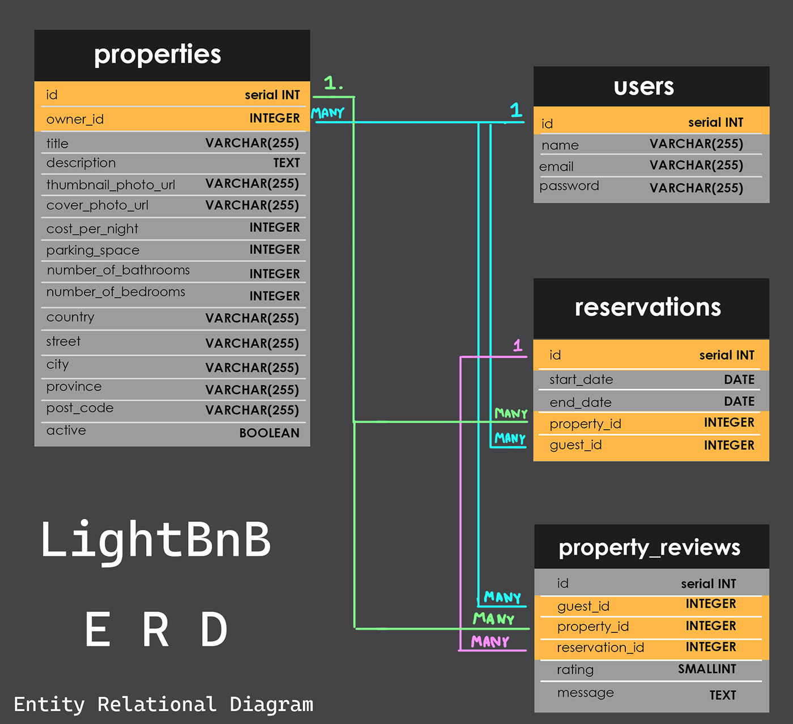

# LightBnB

LightBnB is a straightforward and user-friendly application similar to AirBnB, primarily used for planning trips and finding great places to stay.

Users can sign up and register an account to conveniently access previous reservations and even list their own properties on LightBnB to have others enjoy.

A typical non-signed in user has the ability to browse through all available property listings or use search filters to narrow down their preference to sort properties by location, price, and rating.

## Technologies

Certain safety measures have been employed across the website to to prevent malicious users from accessing private information or tampering with information. Features include:
 - SQL injection prevention
 - Secure cookie encryption
 - (XSS) Cross-Site Scripting prevention `(Coming soon)`

The development of LightBnB leveraged initial server and lightweight frontend code from Lighthouse Labs and utilized the following in its tech stack:
 - HTML
 - CSS
 - JavaScript
 - Express
 - PostgreSQL

<!-- [Lighthouse Labs Starter Repo](https://github.com/lighthouse-labs/LightBnB_WebApp) -->

## Getting Started

1. Open your terminal and create a directory on your local machine with `mkdir LightBnB`
2. CD into the directory and clone the [repository](https://github.com/ChrisPytel/lightBnB).
3. CD into the <u><b>LightBnB_WebApp</b></u> directory.
4. In terminal, run `npm install` to install dependencies.
5. Start the PostgreSQL server, run the command: `startpostgres`
6. In your terminal enter `npm run local`.
7. Open your browser and navigate to [http://localhost:3000](http://localhost:3000).

<!-- NOTE: some cases may need `npm run db:reset` for database connectivity -->

## Dependencies

- Express v 4.17.1
- Nodemon v 1.19.1
- PG v 8.11.5

## LightBnB in Action

### Property Listings Displayed
[]
### LightBnB Search Filter
[]
### LightBnB Login
[]

## Database Design (ERD)
[]